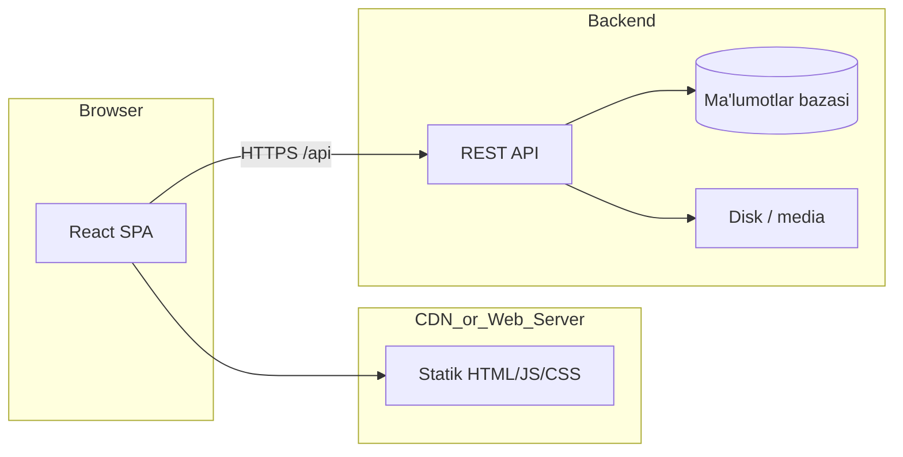
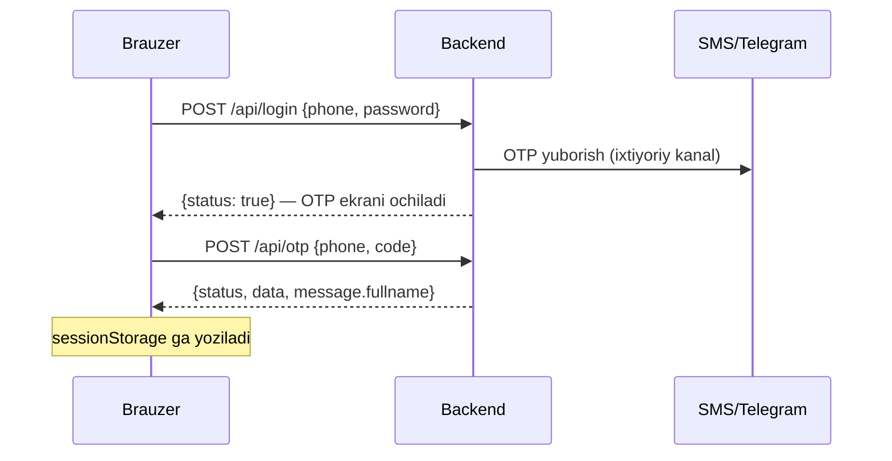

# API kontrakti — Guliston Yoshlar Texnoparki

| Maydon | Qiymat |
|--------|--------|
| **Hujjat versiyasi** | 1.0.0 |
| **Oxirgi yangilanish** | 2026-04-18 |
| **Frontend stack** | React 18, TypeScript, Vite |
| **API prefiks** | `/api` |
| **Kontrakt turi** | REST, JSON (+ `multipart/form-data` yangilik yuklash uchun) |

Bu hujjat backend va frontend o‘rtasidagi **rasman kelishilgan HTTP interfeys**ni tasvirlaydi. O‘zgarishlar **versiya ostida** yozib boriladi va ikkala tom ham xabardor bo‘lishi kerak.

---

## 1. Mazmun

1. [Arxitektura konteksti](#2-arxitektura-konteksti)
2. [Muhit va URL lar](#3-muhit-va-url-lar)
3. [Autentifikatsiya oqimi](#4-autentifikatsiya-oqimi)
4. [Endpointlar](#5-endpointlar)
5. [Ma’lumot modellari](#6-malumot-modellari)
6. [Media va fayllar](#7-media-va-fayllar)
7. [Xatoliklar](#8-xatoliklar)
8. [CORS va xavfsizlik](#9-cors-va-xavfsizlik)
9. [No-funksional talablar](#10-no-funksional-talablar)
10. [Qabul qilish mezonlari](#11-qabul-qilish-mezonlari)
11. [Frontend kod havolalari](#12-frontend-kod-havolalari)
12. [Ma’lum cheklovlar](#13-malum-cheklovlar)

---

## 2. Arxitektura konteksti



- **Frontend** backend bilan faqat **HTTP(S)** orqali muloqot qiladi.
- **Sessiya:** hozirda asosan `sessionStorage` (client-side); kelajakda JWT qo‘shish rejalashtirilishi mumkin.

---

## 3. Muhit va URL lar

### 3.1 Ishlab chiqish (local)

| Komponent | Manzil |
|-----------|--------|
| Frontend dev server | `http://localhost:5173` |
| Backend (tavsiya) | `http://localhost:3000` |
| Brauzerdan ko‘rinadigan API | `http://localhost:5173/api/...` — **Vite proksi** (`vite.config.ts`) `/api` ni backend ga yo‘naltiradi |

**Shart:** developmentda frontend `.env` da `VITE_API_ORIGIN` **bo‘sh** qoldirilganda so‘rovlar bir xil origin orqali ketadi va proksi ishlaydi.

### 3.2 Production

| O‘zgaruvchi | Tavsif |
|-------------|--------|
| `VITE_API_ORIGIN` | Backend **asosiy URL** i, **oxirida `/` yo‘q**. Masalan: `https://api.texnopark.uz` |

To‘liq API bazasi: `{VITE_API_ORIGIN}/api`.

---

## 4. Autentifikatsiya oqimi

Ikki bosqichli jarayon (admin panel: `/admin`).



**Muhim:** frontend **`status`** maydonini tekshiradi (`true`/truthy — muvaffaqiyat).

---

## 5. Endpointlar

### 5.1 `POST /api/login`

**Maqsad:** Administrator telefon va parol bilan birinchi bosqichdan o‘tadi; keyin OTP kiritiladi.

| Xususiyat | Qiymat |
|-----------|--------|
| Content-Type | `application/json` |

**Body:**

```json
{
  "phone": "+998 (XX) XXX-XX-XX",
  "password": "string"
}
```

**Muvaffaqiyat (200):**

```json
{
  "status": true
}
```

**Rad (masalan 401):**

```json
{
  "status": false,
  "detail": "Login yoki parol noto‘g‘ri"
}
```

---

### 5.2 `POST /api/otp`

**Maqsad:** OTP tasdiqlash; muvaffaqiyatda frontend foydalanuvchi ma’lumotlarini saqlaydi.

| Xususiyat | Qiymat |
|-----------|--------|
| Content-Type | `application/json` |

**Body:**

```json
{
  "phone": "+998 (XX) XXX-XX-XX",
  "code": "123456"
}
```

**Muvaffaqiyat (200):**

```json
{
  "status": true,
  "data": {},
  "message": {
    "fullname": "F.I.Sh."
  }
}
```

**Eslatma:** `message.fullname` majburiy — toast xabarda ishlatiladi.

**Rad:**

```json
{
  "status": false,
  "detail": "Tasdiqlash kodi noto‘g‘ri"
}
```

---

### 5.3 `GET /api/all-news`

**Maqsad:** Jamoatga ochiq yangiliklar ro‘yxati (bosh sahifa `/`, `/news`).

**Muvaffaqiyat (200):**

```json
{
  "message": [
    {
      "id": 1,
      "title": "string",
      "description": "<p>HTML</p>",
      "datatime": "2026-04-18T12:00:00.000Z",
      "file": ["relative_or_filename.jpg"]
    }
  ]
}
```

- **`message`** — asosiy kalit (frontend parsing shunga qarab).
- Alternativ holda frontend ro‘yxatni `data` / `news` ichidan ham o‘qishi mumkin (ikkilanmaslik uchun **`message`** ni ishlatish tavsiya etiladi).

---

### 5.4 `GET /api/all-news-by-id/{id}`

**Maqsad:** Bitta yangilik (sahifa `/news/:id`).

**Path parametrlar:** `id` — butun son.

**Muvaffaqiyat (200):**

```json
{
  "message": {
    "id": 1,
    "title": "string",
    "description": "<p>HTML</p>",
    "datatime": "2026-04-18T12:00:00.000Z",
    "file": ["img1.jpg", "img2.jpg"]
  }
}
```

**404:** Yangilik topilmasa — standart xato tuzilmasi yoki `{ "status": false }`.

---

### 5.5 `POST /api/add-news`

**Maqsad:** Admin yangilik qo‘shadi (`/admin/add-news`, forma `multipart`).

| Xususiyat | Qiymat |
|-----------|--------|
| Content-Type | `multipart/form-data` |

**Maydonlar:**

| Maydon | Majburiy | Tavsif |
|--------|-----------|--------|
| `title` | Ha | Matn |
| `description` | Ha | HTML matn |
| `file` | Ko‘pincha ha (frontend validatsiyasi) | Rasm: `image/jpeg`, `image/png`; bir yoki bir nechta bir xil nom bilan |

**Muvaffaqiyat:** `200` yoki `201`; body ixtiyoriy, lekin HTTP status muvaffaqiyatli bo‘lishi kerak.

---

### 5.6 `DELETE /api/delete-news/{id}`

**Maqsad:** Admin dashboard dan yangilikni o‘chirish.

**Path:** `id` — yangilik ID.

**Muvaffaqiyat:** `200` / `204`.

---

### 5.7 `GET /api/media/{filename}`

**Maqsad:** Yangilik rasmini brauzerda ko‘rsatish.

- `filename` — frontend tomonda **`encodeURIComponent`** qilinadi; backend **`decode`** qilishi kerak.
- Fayl yo‘lini normalize qilish va **path traversal** (`../`) dan himoya — **majburiy**.

---

## 6. Ma’lumot modellari

### `NewsArticle` (javob obyekti)

| Maydon | Tip | Majburiy | Izoh |
|--------|-----|----------|------|
| `id` | integer | Ha | Birlamchi kalit |
| `title` | string | Ha | Ko‘rinadigan sarlavha |
| `description` | string | Ha | HTML — frontend `dangerouslySetInnerHTML` |
| `datatime` | string (ISO 8601) | Ha | Vaqt zonasi bilan UTC tavsiya etiladi |
| `file` | string[] | Ha | Fayl nom(lar)i — media URL qurish uchun |

---

## 7. Media va fayllar

Frontend media URL:

```
{API_ORIGIN}/api/media/{encodeURIComponent(filename)}
```

Backend:

- Saqlangan fayl nomini bazada saqlash;
- Berishda to‘g‘ri `Content-Type` (`image/jpeg`, …);
- **Hech qachon** foydalanuvchi kiritgan nomni tekshirmasdan fayl tizimiga yozmaslik.

---

## 8. Xatoliklar

Tavsiya etilgan JSON xato tanasi:

```json
{
  "status": false,
  "detail": "Ingliz yoki o‘zbek tilida qisqa izoh",
  "code": "NEWS_NOT_FOUND"
}
```

`code` ixtiyoriy, lekin integratsiya va monitoring uchun foydali.

**HTTP kodlar:**

| Kod | Qo‘llanishi |
|-----|-------------|
| 400 | Noto‘g‘ri so‘rov |
| 401 | Autentifikatsiya talab qilinadi |
| 403 | Taqiq |
| 404 | Resurs yo‘q |
| 413 | Fayl juda katta |
| 415 | Noto‘g‘ri media tip |
| 500 | Server ichki xatosi |

---

## 9. CORS va xavfsizlik

### CORS

Quyidagi **Origin** lar uchun ruxsat:

- `http://localhost:5173`
- `http://127.0.0.1:5173`
- Production frontend URL — **buyurtmachi taqdim etadi**

Metodlar: kamida `GET`, `POST`, `DELETE`. Headerlar: `Content-Type`, kelajakda `Authorization`.

### Xavfsizlik tavsiyalari

1. **Parollar:** hech qachon ochiq saqlanmasin (hash).
2. **OTP:** qisqa muddat, bir martalik.
3. **`add-news` / `delete-news`:** production da **majburiy** token yoki sessiya (frontend keyin yangilanishi mumkin).
4. **`description` HTML:** server tomonda sanitizatsiya yoki cheklangan teglar ro‘yxati — XSS oldini olish.
5. **HTTPS** — production da majburiy.

---

## 10. No-funksional talablar

| Talab | Tavsif |
|-------|--------|
| Mavjudlik | API asosiy endpointlar uchun monitoring (ixtiyoriy) |
| Backup | Bazaning muntazam rezerv nusxasi |
| Vaqt | API javobi odatda &lt; 500 ms (tarmoqdan tashqari) |
| Fayl hajmi | Yangilik rasmi uchun yuqori chegara kelishiladi (masalan 5 MB — frontend bilan mos) |

---

## 11. Qabul qilish mezonlari

Backend **“tayyor”** deb topiladi, agar:

1. Yuqoridagi endpointlar ishlaydi va misol javoblar shu hujjatga mos keladi.
2. CORS prod frontend URL uchun yoqilgan.
3. `/news` va bosh sahifada yangiliklar chiqadi (GET ishlaydi).
4. Admin: login → OTP → yangilik qo‘shish → ro‘yxatda ko‘rinadi → o‘chirish ishlaydi.
5. Media URL dan rasm brauzerda ochiladi.

---

## 12. Frontend kod havolalari

| Modul | Fayl |
|-------|------|
| API chaqiriqlari | `src/server/Admin/Server.ts` |
| API bazasi URL | `src/lib/apiOrigin.ts` |
| Yangilik formasi | `src/components/Admin/News/NewsForm.tsx` |
| Dev proksi | `vite.config.ts` |
| Admin guard | `src/PrivateRoute.tsx`, `src/pages/admin/Login.tsx` |

---

## 13. Ma’lum cheklovlar

- Frontend ba’zi joylarda **`!response.status === false`** kabi ifodalar bor — backend **`status: true`** ni aniq qaytarsin.
- Admin yo‘llari brauzerda faqat marshrut bilan himoyalangan; server tomonda qat’iy tekshiruv **tavsiya etiladi**.

---

## Qo'shimcha manbalar

- Mashina-o‘qiladigan spetsifikatsiya: [`openapi.yaml`](openapi.yaml)
- Integratsiya va deploy checklist: [`../HANDOFF_CHECKLIST.md`](../HANDOFF_CHECKLIST.md)

---

*Bu hujjat backend ishlab chiqish va QA uchun rasmiy asos hisoblanadi.*
